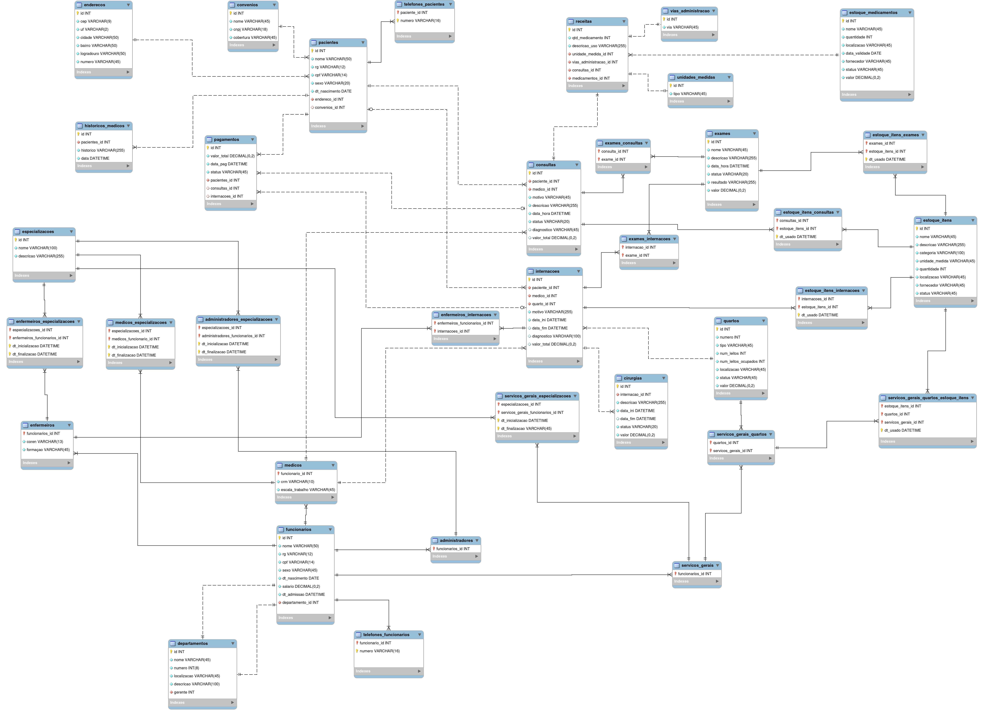

# 🏥 Banco de Dados Hospitalar

Projeto acadêmico desenvolvido durante a disciplina de **Banco de Dados II**, com foco em modelagem, administração e gerenciamento de banco de dados relacionais para um ambiente hospitalar.

O sistema foi modelado utilizando MySQL e SQL, aplicando conceitos de modelagem relacional, integridade referencial, procedures, triggers, views, controle de usuários e consultas avançadas.

---

# 🛠️ Tecnologias Utilizadas

- SQL
- MySQL
- MySQL Workbench

---

# 📚 Funcionalidades

- Cadastro de pacientes
- Cadastro de médicos, enfermeiros e administradores
- Controle de consultas e internações
- Gerenciamento de quartos e leitos
- Controle de exames e cirurgias
- Controle de estoque hospitalar
- Controle de medicamentos
- Histórico médico de pacientes
- Sistema de pagamentos
- Controle de convênios

---

# 🗄️ Estrutura do Banco

O banco possui diversas entidades relacionadas entre si por meio de chaves primárias e estrangeiras.

## Principais tabelas

- pacientes
- funcionarios
- medicos
- enfermeiros
- consultas
- internacoes
- exames
- cirurgias
- pagamentos
- estoque_itens
- estoque_medicamentos
- quartos
- departamentos

## 🗂️ Diagrama Entidade-Relacionamento

O diagrama abaixo representa a estrutura relacional do banco de dados hospitalar.

---

# ⚙️ Recursos Implementados

## Procedures
- Geração automática de receitas médicas

## Triggers
- Atualização automática do estoque de medicamentos
- Soma automática dos valores de exames
- Soma automática dos valores de cirurgias
- Atualização do valor total de consultas e internações

## Views
- Prontuário médico consolidado
- Visualização de receitas médicas

## Subqueries
- Identificação de médicos com maior quantidade de consultas

## Controle de Usuários
Perfis criados:
- Médicos
- Enfermeiros
- Administradores
- Recepcionistas

---

# 🔐 Conceitos Aplicados

- Modelagem Relacional
- Normalização
- Integridade Referencial
- Joins
- Procedures
- Triggers
- Views
- Controle de Permissões
- SQL Avançado

---

# 👨‍💻 Autor

Developed by Manoel Nogueira Melo Filho

- LinkedIn: https://www.linkedin.com/in/manoel-nogueira-3288b9361/
- E-mail: nogueirafilho888@gmail.com 
